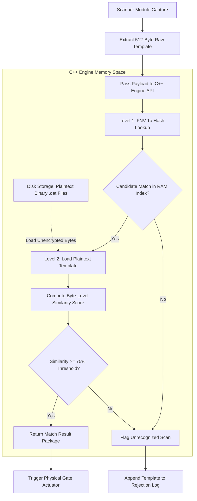
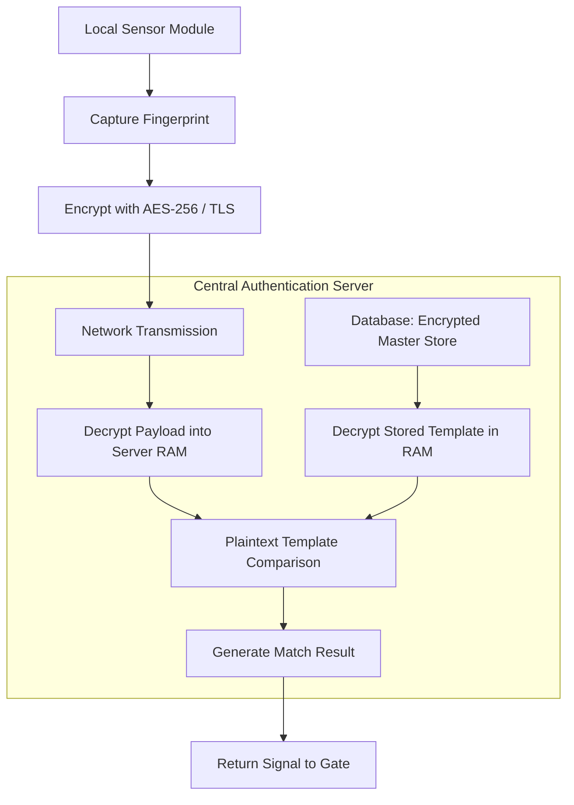
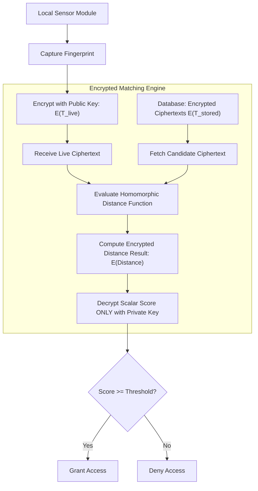
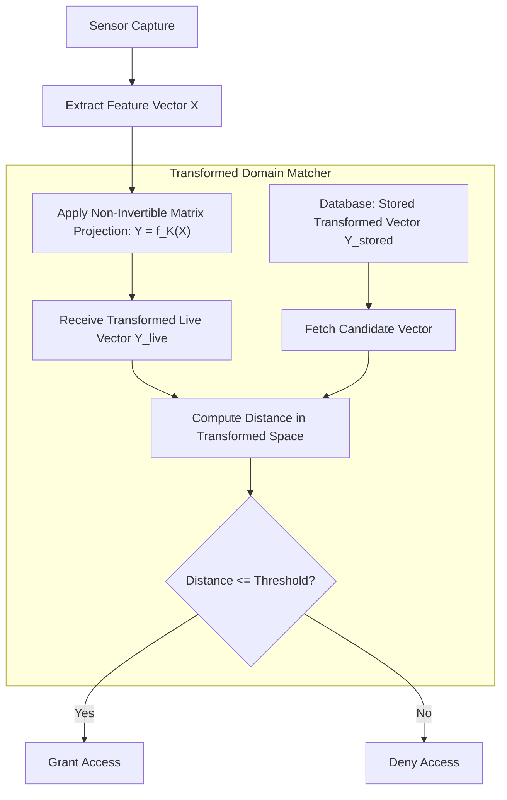

# Final C++ Biometric Matching Engine

## System Overview

The Final C++ Biometric Engine is a cross-platform, bare-metal database and biometric verification library designed for campus gate access control systems. Implemented in standard C++17, the engine interfaces directly with physical fingerprint scanning hardware and provides a high-throughput API for student authentication, daily log management, and curfew enforcement.

---

## Architectural Objectives and The Biometric Trilemma

Modern biometric access control architectures are governed by three primary performance parameters:

1. **Speed**: Minimizing lookup latency to support high-density peak-hour campus gate throughput (target: $< 2.0\,\text{ms}$ per authentication event).
2. **Efficiency**: Reducing computational and memory footprint to allow execution on resource-constrained embedded microcontrollers (e.g., Raspberry Pi, embedded ARM controllers).
3. **Security**: Guaranteeing biometric template confidentiality, non-reversibility, and immunity against database theft or memory-scraping attacks.

```
                  Biometric Engineering Trilemma
                  
                             Speed
                            /     \
                           /       \
                          /         \
                         /           \
             Efficiency ------------- Security
```

### Analysis of the Current Engine Model

In the current baseline engine ([Final_cpp_engine.md](file:///Users/devanshkhosla/Projects/CS-Club%20project/Final_cpp_engine/Final_cpp_engine.md)), the architecture prioritizes **Speed** and **Efficiency** at the direct expense of **Security**:

* **Speed Optimization**: Achieving sub-millisecond ($< 0.5\,\text{ms}$) verification using an in-memory Level-1 FNV-1a hash index followed by a Level-2 byte-array similarity search.
* **Efficiency Optimization**: Storing 512-byte raw minutiae templates (`uint8_t fingerprint_template[512]`) in contiguous binary disk structures without serialization framework overhead.
* **Security Vulnerability**: The current model sacrificed cryptographic protection to achieve maximum operational performance. Raw biometric data is stored unencrypted in `.dat` binary files on disk and loaded into memory as plaintext during verification. If the physical host or database is compromised, biometric templates are permanently exposed.

---

## Current Architecture Flowchart

The diagram below illustrates the operational flow of the current engine during a live gate verification sequence.



---

## Related Work Architectures

Existing literature and commercial access control systems utilize alternative trade-off models to handle biometric data. The two primary paradigms are detailed below.

### Model A: Server-Side Decryption Paradigm (Standard Cloud Access Control)

In cloud-assisted biometric architectures, encrypted payloads are transmitted over network channels and decrypted on a central server prior to matching.



* **Advantage**: Secure in transit over public networks.
* **Vulnerability**: Creates a high-value central target. Server memory scraping or admin access exposes decrypted templates in RAM. Network round-trip delays introduce $50\text{--}300\,\text{ms}$ latency.

---

### Model B: Homomorphic Encryption Paradigm (Encrypted Domain Matching)

In privacy-centric literature, systems utilize Homomorphic Encryption (e.g., Paillier, BFV, CKKS) to evaluate distance metrics directly on ciphertexts without decryption.



* **Advantage**: Complete mathematical confidentiality. Raw biometric data is never decrypted in memory or on disk.
* **Vulnerability**: Extreme computational overhead. Polynomial multiplication on ciphertexts increases match latency to $80\text{--}250\,\text{ms}$ per event, creating severe throughput bottlenecks during peak gate traffic.

---

### Model C: Cancelable Biometrics Paradigm (Non-Invertible Transformation)

Cancelable biometrics apply a intentional, repeatable mathematical transformation to feature vectors prior to storage and comparison.



* **Advantage**: Fast execution ($1\text{--}2\,\text{ms}$) and revocable. If a template key is compromised, a new transformation key $K$ is generated without changing the user's physical biometric.
* **Vulnerability**: Requires precise key management across endpoints; partial geometric structural information can remain susceptible to alignment dictionary attacks if keys are shared.

---

## Comparative Protocol Analysis

The table below provides a formal comparison of established biometric protection protocols documented in academic literature versus the current baseline engine.

| Protocol / Scheme | Primary Cryptographic Mechanism | Lookup Latency | Storage Overhead | Protection Level | ISO/IEC 24745 Compliance | Primary Failure / Bottleneck |
| :--- | :--- | :--- | :--- | :--- | :--- | :--- |
| **Current Engine Baseline** | None (Plaintext Byte Matching) | $< 0.5\,\text{ms}$ | 512 Bytes / Record | None (0) | Non-Compliant | Vulnerable to database theft and RAM scraping |
| **AES-256 Envelope** | Symmetric Block Cipher at Rest | $1.2\,\text{ms}$ | 512 Bytes + IV | Medium (At Rest Only) | Partial | Decrypts to plaintext in RAM during comparison |
| **Fully Homomorphic Encryption (FHE)** | Lattice Cryptography (BFV / CKKS) | $80\text{--}250\,\text{ms}$ | $> 128\,\text{KB}$ / Record | Maximum | Fully Compliant | Extreme computational latency; unusable for peak gate queues |
| **Partially Homomorphic Encryption (PHE)** | Additive Homomorphic (Paillier) | $15\text{--}45\,\text{ms}$ | $> 2\,\text{KB}$ / Record | High | Fully Compliant | Multiplication and division steps cause processing delays |
| **Cancelable Biometrics** | Non-Invertible Matrix Transformation | $1.0\text{--}2.0\,\text{ms}$ | 512 Bytes / Record | High | Fully Compliant | Susceptible to key-correlation attacks if keys leak |
| **Fuzzy Vault / BioHashing** | Key Binding with Chaff Polynomials | $3.0\text{--}8.0\,\text{ms}$ | $> 4\,\text{KB}$ / Record | High | Fully Compliant | High False Rejection Rate (FRR) under poor scan quality |

---

## Technical Problem Statement

The comparative analysis reveals a core trade-off in biometric engine design:

1. **High Security Protocols (FHE / PHE)** eliminate template exposure but introduce latency penalties up to $250\,\text{ms}$, reducing gate throughput from $> 120$ scans/minute to $< 15$ scans/minute.
2. **High Speed Protocols (Current Baseline)** achieve sub-millisecond execution but store and process unencrypted biometric features, violating ISO/IEC 24745 protection guidelines.

Addressing this gap requires evaluating architectural enhancements that introduce cryptographic or non-invertible domain protection without degrading the real-time performance required for campus access management.
