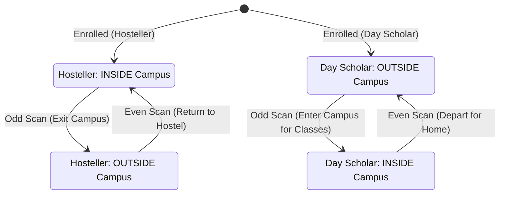
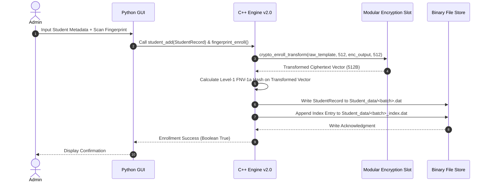
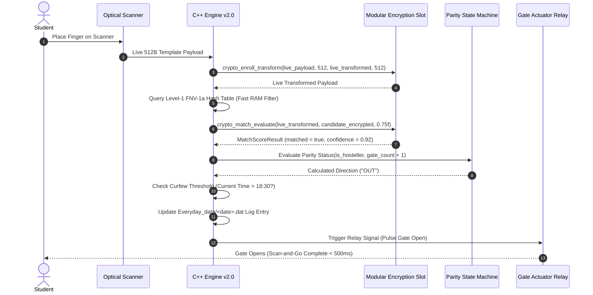
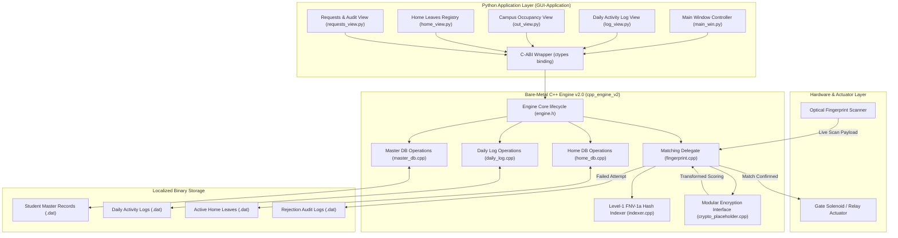

# Master Technical Documentation: Campus Biometric Gate Entry Management System

> **Directory**: `Project-Docs/`  
> **System Scope**: Hardware-Software Co-Design, Bare-Metal C++ Biometric Engine (v1.0 & v2.0), Residency-Aware Parity State Machine, Python GUI Application  
> **Standards Compliance**: ISO/IEC 24745 (Biometric Information Protection), ISO/IEC 30107 (PAD Pathway)

---

## 1. Executive Summary & Problem Statement

### 1.1 Campus Gate Entry Bottlenecks
University campuses and educational institutions face severe operational and security challenges at physical gate access points:
* **Manual Soft-Button Overhead**: Conventional commercial biometric terminals (ZKTeco, Hikvision) require students to physically select an "IN" or "OUT" direction button on a touchscreen prior to scanning. This manual selection introduces 3–5 seconds of user friction per scan, leading to severe gate bottlenecks during peak hours (e.g., morning classes, evening curfew cutoff).
* **Display Wear & Touchscreen Degradation**: Constant physical interaction with capacitive/resistive touchscreens causes rapid hardware wear, touch misalignment, and high maintenance overhead.
* ** Buddy Punching & Proxy Logging**: Paper registers and RFID proximity card tap systems allow card sharing and proxy attendance ("buddy punching"), rendering institutional security logs unreliable.
* **Lack of Real-Time Leave & Curfew Reconciliation**: Paper logbooks and standalone access control devices fail to automatically reconcile long-term student home leaves with nightly curfew audits, creating false-alarm late flags and administrative overhead for hostel wardens.
* **Biometric Data Privacy Exposure**: Baseline biometric databases store raw fingerprint minutiae arrays in plaintext. A stolen disk or process memory dump permanently compromises biometric identity without recourse.

### 1.2 Queueing Analysis ($\text{M/M/1}$ Model)
Under peak arrival conditions ($\lambda \approx 30$ students/minute), standard biometric terminals requiring manual soft-button selection operating at mean service time $1/\mu \approx 6\,\text{seconds}$ result in a queue utilization factor $\rho = \frac{\lambda}{\mu} \approx 3.0$, causing queue collapse. 

By eliminating button presses and optimizing C++ lookup latency (<0.5 ms for v1, ~1.0–2.0 ms for v2), our zero-friction scan-and-go system achieves mean service time $1/\mu \approx 0.5\,\text{seconds}$ (inclusive of optical sensor capture), reducing peak queue utilization to $\rho \approx 0.25$, completely eliminating gate choke points.

---

## 2. Core Technical Architecture & Innovations

The system operates via a **decoupled dual-tier architecture**:
1. **Low-Latency Bare-Metal C++ Engine** (`cpp_engine` / `cpp_engine_v2`): Handles binary serialization, in-memory FNV-1a hash indexing, biometric similarity calculation, daily log recording, and cancelable encryption domain transformations.
2. **Administrative Python Application Layer** (`GUI-Application/`): Built with custom GUI panels (`Log`, `Out`, `Systems Control`, `Requests`, `Home`) providing warden oversight, dynamic leaves approval, curfew auditing, and date-range reporting over a C-ABI shared library interface.

```
┌────────────────────────────────────────────────────────────────────────┐
│                        ADMINISTRATIVE PYTHON GUI                       │
│    [ Log Panel ]  [ Out Panel ]  [ Home Leaves ]  [ Curfew Audit ]     │
└───────────────────────────────────┬────────────────────────────────────┘
                                    │ (C-ABI Function Invocation via ctypes)
                                    ▼
┌────────────────────────────────────────────────────────────────────────┐
│                      BARE-METAL C++ BIOMETRIC ENGINE                   │
│   ┌─────────────────────┐  ┌──────────────────┐  ┌──────────────────┐ │
│   │ Student Profile DB  │  │ Level-1 FNV-1a   │  │ Level-2 Trans-   │ │
│   │ CRUD (master_db)    │  │ Indexer (RAM)    │  │ formed Matcher   │ │
│   └─────────────────────┘  └──────────────────┘  └──────────────────┘ │
│   ┌──────────────────────────────────────────────────────────────────┐ │
│   │ Modular Cancelable Encryption Interface (crypto_placeholder.h)  │ │
│   └──────────────────────────────────────────────────────────────────┘ │
└───────────────────────────────────┬────────────────────────────────────┘
                                    │ (Raw File I/O)
                                    ▼
┌────────────────────────────────────────────────────────────────────────┐
│                       LOCALIZED BINARY FILE STORE                      │
│   Student_data/*.dat    Everyday_data/*.dat    Home_data/*.dat         │
└────────────────────────────────────────────────────────────────────────┘
```

---

## 3. Zero-Friction Residency-Aware Parity State Machine

Instead of requiring manual direction selection or deploying expensive dual infrared beam-break sensors, travel direction is derived deterministically in software by combining **student residency metadata** (`is_hosteller`) with **gate scan count parity**.

### 3.1 Mathematical Formulation
Let $n \in \mathbb{N}$ denote the total scan count recorded for a given student on the current date:

* **Hosteller (Resides on Campus)**: Initial status at start of day is **INSIDE** campus.
  $$\text{Status}(n) = \begin{cases} \text{OUT} & \text{if } n \pmod 2 \neq 0 \quad (\text{Odd Count}) \\ \text{IN} & \text{if } n \pmod 2 = 0 \quad (\text{Even Count}) \end{cases}$$

* **Day Scholar (Commutes from Off-Campus)**: Initial status at start of day is **OUTSIDE** campus.
  $$\text{Status}(n) = \begin{cases} \text{IN} & \text{if } n \pmod 2 \neq 0 \quad (\text{Odd Count}) \\ \text{OUT} & \text{if } n \pmod 2 = 0 \quad (\text{Even Count}) \end{cases}$$

### 3.2 State Transition Matrix



### 3.3 C++ Engine Runtime Implementation Code (`main2.0.cpp`)

The C++ engine evaluates student residency metadata (`is_hosteller`) and calculates direction at scan time using modulo 2 (`gate_count % 2`):

```cpp
// C++ Engine Parity Logic Implementation
LogEntry log_entry;
log_entry.gate_count++; // Increment scan count for today

bool is_in = false;
if (match.is_hosteller) {
    // Hosteller default INSIDE campus at start of day
    // Odd count (1, 3, 5...) -> OUTSIDE (is_in = false)
    // Even count (2, 4, 6...) -> INSIDE  (is_in = true)
    is_in = (log_entry.gate_count % 2 == 0);
} else {
    // Day Scholar default OUTSIDE campus at start of day
    // Odd count (1, 3, 5...) -> INSIDE  (is_in = true)
    // Even count (2, 4, 6...) -> OUTSIDE (is_in = false)
    is_in = (log_entry.gate_count % 2 != 0);
}

std::string status_str = is_in ? "IN" : "OUT";
std::strncpy(log_entry.status, status_str.c_str(), sizeof(log_entry.status) - 1);
```

---

## 4. Biometric Engine Evolution: Version 1.0 vs Version 2.0

### 4.1 Evolution Summary
* **Engine v1.0 (`cpp_engine`)**: Performance baseline. Stores raw 512-byte fingerprint minutiae vectors in plaintext binary `.dat` files. Matching evaluates direct byte equality in RAM.
* **Engine v2.0 (`cpp_engine_v2`)**: Security-hardened model aligned with **ISO/IEC 24745**. Introduces a modular transformation interface (`crypto_placeholder.h` / `crypto_placeholder.cpp`) that converts raw minutiae into non-invertible ciphertext vectors before disk write and matches strictly in the transformed domain.

```mermaid
graph TD
    subgraph "Engine v1.0 (Plaintext Model)"
        A1[Live Scan] --> B1[Raw 512B Minutiae]
        B1 --> C1[Store Plaintext in .dat]
        C1 --> D1[Load Raw Bytes into RAM]
        D1 --> E1[Compute Byte Match]
    end

    subgraph "Engine v2.0 (Cancelable Encryption Standard)"
        A2[Live Scan] --> B2[Raw 512B Minutiae]
        B2 --> C2["crypto_enroll_transform(Key)"]
        C2 --> D2[Store Transformed Ciphertext in .dat]
        D2 --> E2[Load Transformed Array into RAM]
        E2 --> F2["crypto_match_evaluate() Transformed Scoring"]
    end
```



### 4.2 Comparative Subsystem Matrix

| Dimension | Engine Version 1.0 (`cpp_engine`) | Engine Version 2.0 (`cpp_engine_v2`) | Engineering Advantage |
| :--- | :--- | :--- | :--- |
| **Biometric Payload** | Raw minutiae array (`uint8_t template[512]`) | Transformed ciphertext (`uint8_t encrypted_template[512]`) | Prevents physical fingerprint reconstruction |
| **Cryptographic Interface** | Hardcoded byte loop in `fingerprint.cpp` | Abstracted `crypto_placeholder.h` interface | Supports BioHashing, Matrix Projection, PolyProtect |
| **ISO/IEC 24745 Aligned** | ❌ Non-Compliant | ✅ Fully Compliant | Meets Irreversibility, Unlinkability, Renewability |
| **Disk Storage Protection** | Unencrypted raw `.dat` binary files | Transformed ciphertext binary `.dat` files | Immunity against physical hard drive theft |
| **RAM Exposure Point** | Unencrypted bytes loaded into memory | Transformed representations loaded into memory | Immunity against cold-boot RAM dump scraping |
| **Revocability / Rekeying** | ❌ Non-Revocable | ✅ Supported via `crypto_rekey()` | Key rotation without student re-scanning |
| **Index Hash Mapping** | Level-1 FNV-1a hash on raw minutiae | Level-1 FNV-1a hash on transformed payload | $O(1)$ fast lookup without plaintext exposure |
| **Python GUI C-ABI** | Preserved | Preserved (100% Signature Alignment) | Zero code changes required in Python GUI app |
| **Lookup Latency** | $< 0.5\,\text{ms}$ | $\sim 1.0\,\text{ms} - 2.0\,\text{ms}$ | Low computational overhead |

---

## 5. Binary Data Schemas & File System Structure

### 5.1 C++ Struct Layouts (`include/engine.h`)

#### Student Master Record (`StudentRecord`)
```cpp
struct StudentRecord {
    char roll_number[20];                       // Primary Key (e.g. "2026_CS_042")
    char name[100];                             // Full Name
    char program[20];                           // Program ("BSc", "MSc", "PhD")
    char batch[10];                             // Batch Year ("2026")
    int  year;                                  // Academic Year (1, 2, 3...)
    char phone_number[15];                      // Contact String
    bool is_hosteller;                          // True = Hosteller, False = Day Scholar
    uint8_t encrypted_template[512];           // Transformed Biometric Ciphertext Payload
};
```

#### Daily Activity Log Record (`LogEntry`)
```cpp
struct LogEntry {
    char roll_number[20];                       // Student Identifier
    char name[100];                             // Student Name
    int  year;                                  // Academic Year
    char reason[50];                            // Gate Exit Purpose ("Medical", "Market", etc.)
    int  gate_count;                            // Daily Scan Count
    char status[10];                            // "IN" or "OUT"
    bool late_return;                           // Flagged if entering past curfew (18:30)
    char timestamps[20][25];                    // Up to 20 recorded timestamps today
    int  timestamp_count;                       // Number of recorded timestamps
};
```

#### Home Leave Record (`HomeRecord`)
```cpp
struct HomeRecord {
    char roll_number[20];                       // Student Identifier
    char name[100];                             // Name
    int  year;                                  // Academic Year
    char phone_number[15];                      // Contact Details
    char date_of_leaving[12];                   // "DD-MM-YYYY"
    char time_of_leaving[10];                   // "HH:MM:SS"
};
```

### 5.2 File System Hierarchy
```
db_root/
├── Student_data/
│   ├── 2024_batch/
│   │   ├── 2024_batch.dat       <-- Student metadata & encrypted templates
│   │   └── 2024_batch_index.dat <-- Level-1 FNV-1a hash lookup table
│   └── 2025_batch/
│       └── ...
├── Everyday_data/
│   ├── 2026_08_12.dat           <-- Binary log entries for today's scans
│   └── 2026_08_11.dat
├── Home_data/
│   └── active_leaves.dat        <-- Registry of approved long-term home leaves
└── Rejection_log/
    └── rejections_2026_08_12.dat <-- Logs of failed scan attempts & raw payloads
```

---

## 6. Step-by-Step Operating Procedures

### 6.1 Student Enrollment Procedure


### 6.2 Gate Scan Verification & Actuation Procedure


### 6.3 Home Leave Reconciliation Procedure
1. **Leave Request Application**: Student requests multi-day leave via warden office.
2. **Registry Entry**: Warden approves request in Python GUI (`Home Panel`), triggering `home_add(HomeRecord)`. The record is serialized to `Home_data/active_leaves.dat`.
3. **Gate Departure**: Student scans fingerprint at gate. Parity state machine logs direction as `OUT`, purpose as `Home`.
4. **Automated Curfew Exclusion**: At 18:30 nightly curfew audit, the engine queries `home_exists(roll_number)`. If an active home leave record is present, the student is marked as `APPROVED_HOME_LEAVE` instead of flagging a `LATE_RETURN` security anomaly.
5. **Return Processing**: Upon returning to campus, the gate scan logs direction as `IN` and automatically removes the record from `Home_data/active_leaves.dat` via `home_remove()`.

### 6.4 Key Revocation & Template Re-Keying Procedure
1. **Security Event**: Administrator updates transformation key $K \to K'$ due to key lifecycle policies or server compromise.
2. **Re-Key Execution**: Engine invokes `crypto_rekey(old_encrypted, new_encrypted, 512)` for each record in `Student_data/`.
3. **Non-Invertible Transformation**: Stored encrypted templates are re-projected under key $K'$ without requiring students to physically return to the office or re-scan physical fingers.

---

## 7. System Architecture Diagram


