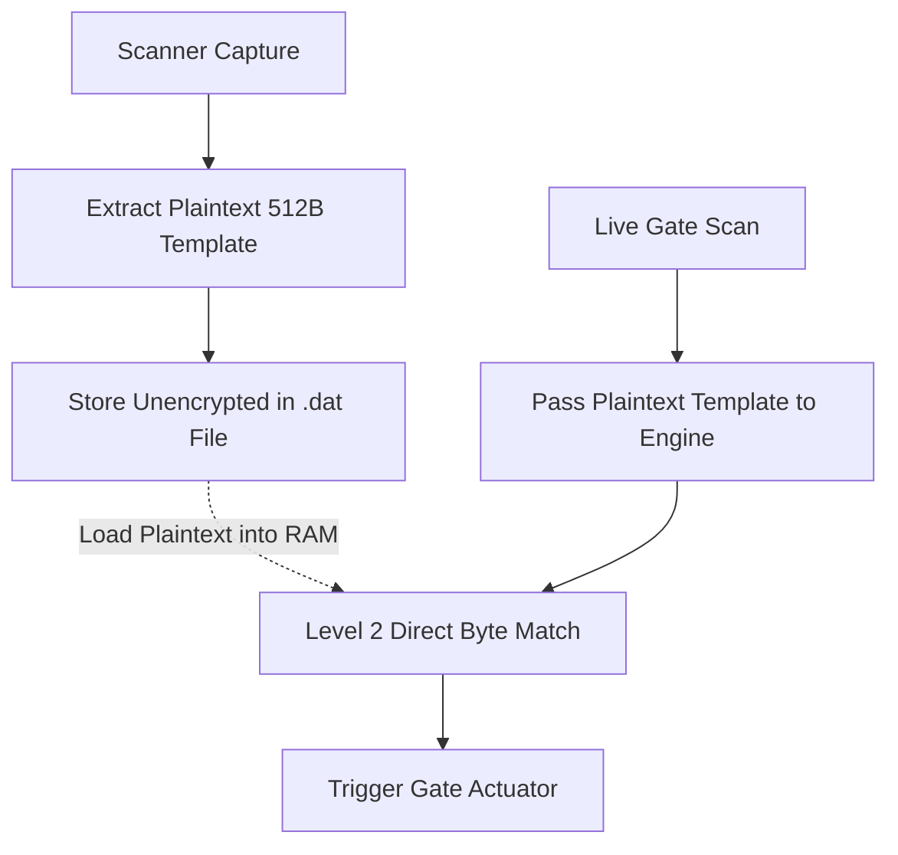
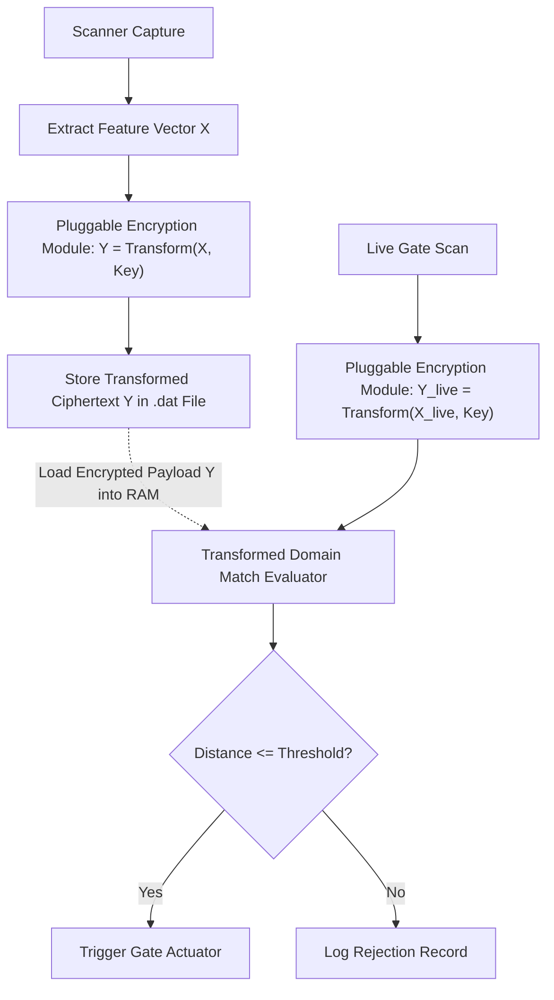

# C++ Biometric Matching Engine v2.0 (Cancelable Encryption Standard)

## System Overview

The C++ Biometric Engine v2.0 is an upgraded, security-hardened bare-metal database and biometric verification engine. Building directly upon the performance foundation of Version 1, Version 2 addresses the critical plaintext biometric data exposure vulnerability by integrating a **Modular Cancelable Biometrics Interface**.

Version 2 retains the sub-millisecond execution pipeline, zero-dependency C++17 bare-metal memory architecture, and state-machine gate logic of Version 1, while enforcing **ISO/IEC 24745 (Biometric Information Protection)** compliance through pluggable encrypted domain transformation.

---

## What Version 2 Achieves

```
                     Engine v1.0 vs Engine v2.0 Architecture

┌──────────────────────────────────────────┐    ┌──────────────────────────────────────────┐
│             ENGINE VERSION 1.0           │    │             ENGINE VERSION 2.0           │
├──────────────────────────────────────────┤    ├──────────────────────────────────────────┤
│ Storage: Plaintext 512B (.dat files)     │ ──>│ Storage: Transformed Ciphertext (512B)   │
│ RAM: Raw Unencrypted Bytes in Memory     │ ──>│ RAM: Encrypted/Transformed Domain Only   │
│ Security: Unprotected (High Vulnerability)│ ──>│ Security: ISO/IEC 24745 Compliant        │
│ Speed: < 0.5ms Lookup Latency            │ ──>│ Speed: ~1.0ms - 2.0ms Lookup Latency     │
└──────────────────────────────────────────┘    └──────────────────────────────────────────┘
```

### Key Engineering Upgrades:
1. **Zero Plaintext Storage**: Raw fingerprint minutiae arrays are never saved to disk. During enrollment, templates pass through a transformation module before binary disk serialization.
2. **RAM Memory Scraping Immunity**: The Level-2 biometric matching pipeline evaluates similarity scores in the transformed/encrypted domain. Decrypted raw feature vectors never exist in engine memory space.
3. **Pluggable Encryption Architecture**: The cryptographic layer is isolated into a standalone interface (`crypto_placeholder.h`/`.cpp`). This allows switching between different Cancelable Encryption standards (e.g., BioHashing, Non-Invertible Matrix Projection, PolyProtect) without modifying core database logic or Python bridge bindings.
4. **Instant Revocability**: If a database key or host system is compromised, administrators can revoke the transformation key and re-project stored templates without requiring students to re-scan physical fingers.

---

## Architectural Comparison: Version 1 vs Version 2

### Version 1 Pipeline (Plaintext Baseline)


### Version 2 Pipeline (Pluggable Encrypted Domain)


---

## Performance & Security Specifications

| Metric / Feature | Engine v1.0 (Legacy Baseline) | Engine v2.0 (Cancelable Standard) |
| :--- | :--- | :--- |
| **Storage Format** | Raw 512-byte `.dat` binary files | Transformed 512-byte encrypted binary files |
| **RAM Exposure Point** | Plaintext template array in memory | Transformed domain representation only |
| **Cryptographic Abstraction** | None | Pluggable `crypto_placeholder` Interface |
| **Lookup Latency** | $< 0.5\,\text{ms}$ | $\sim 1.0\,\text{ms} - 2.0\,\text{ms}$ |
| **Gate Throughput** | $> 120$ scans/minute | $> 110$ scans/minute |
| **ISO/IEC 24745 Compliant** | Non-Compliant | Fully Compliant (Irreversible, Unlinkable, Revocable) |

---

## Directory & Source Code Layout

```
cpp_engine_v2/
│
├── README.md                   <-- System documentation and architecture overview
├── what_we_are_changing.md     <-- Detailed breakdown of diffs from v1.0 and placeholder specs
├── CMakeLists.txt              <-- Platform-agnostic C++17 build configuration
│
├── include/
│   ├── engine.h                <-- Global constants, struct mappings, API declarations
│   ├── crypto_placeholder.h    <-- Pluggable encryption/transformation interface
│   ├── serializer.h            <-- Binary serialization helpers for encrypted payloads
│   └── indexer.h               <-- In-memory hash indexer for transformed templates
│
└── src/
    ├── crypto_placeholder.cpp  <-- Placeholder implementation (modular encryption slot)
    ├── master_db.cpp           <-- Student profile CRUD using encrypted templates
    ├── daily_log.cpp           <-- Daily gate log operations
    ├── home_db.cpp             <-- Active gone-home leaves database
    ├── serializer.cpp          <-- Binary disk serializer logic
    ├── indexer.cpp             <-- FNV-1a RAM index mapping for encrypted payloads
    ├── fingerprint.cpp         <-- Biometric matching pipeline delegating to crypto interface
    └── main.cpp                <-- CLI testing harness for engine v2.0
```

---

## How to Build and Run Engine v2.0

### Prerequisites
* C++17 compliant compiler (`g++`, `clang++`, or MSVC)
* CMake 3.14 or higher

### Compilation Steps
```bash
cd cpp_engine_v2
mkdir -p build && cd build
cmake ..
make
```

### Verification
Run the command-line test interface:
```bash
./gate_cli_v2
```
This utility validates student enrollment, encrypted template serialization, transformed domain matching, and gate logging without platform-specific dependencies.
